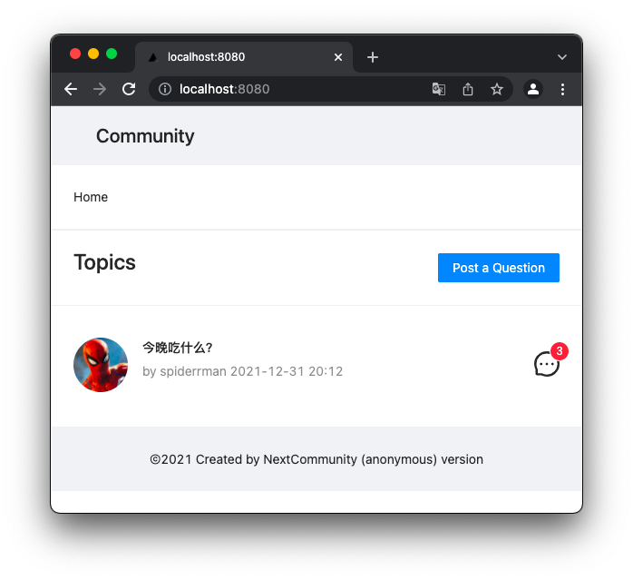

# NextCommunity

1 Run monogodb in localhost

2 Create Database : community

3 Create Collection : topics replys users 

4 Import users.json to mongodb : community.users

5 clone NextCommunity

```
clone https://github.com/codetyphon/NextCommunity
```

6 Install

```
yarn install
```

7 Try it 

```
yarn dev
```

8 Build
```
yarn build
```

9 Start
```
yarn start
```

### 介绍

这是一个匿名社区。

提交主题及回复时采用随机用户，不记录cookie，无需注册，无需登录，注重隐私保护。

### demo

